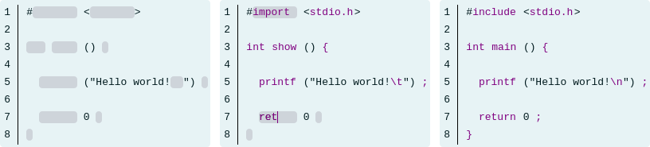
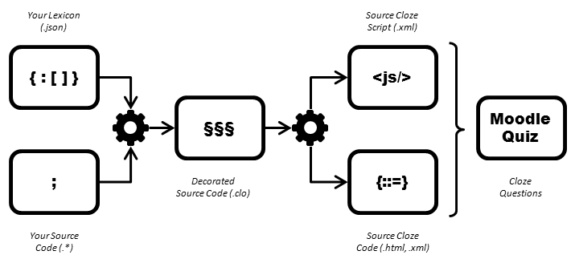

# PySourceCloze

  

**PySourceCloze** helps you generate cloze questions in an easy, fast, and efficient way from source files for programming quizzes and exams on [Moodle](https://moodle.org/) learning management system. Moodle clozes customized by PySourceCloze are easy to fill and easy to read for source code filling. To do so, PySourceCloze uses a simple source code decoration syntax that helps you decorate your source code manually or automatically from your custom lexicons and get the HTML code or XML file needed by Moodle.

_Optimize correction time; offer more training sessions to your students beyond multiple choice questions!_

## Getting Started

### Prerequisites

* Python &ge; 3.7 is required ([downloads](https://www.python.org/downloads/)):
  * PySourceCloze has been tested on Python versions 3.7, 3.8, 3.9, and 3.10.

* Editing access to Moodle 3 or Moodle 4:
  * PySourceCloze has been tested on Moodle versions 3.1 LTS, 3.5 LTS, 3.6, 3.9 LTS, and 4.0 beta.

* Firefox or Safe Exam Browser:
  * PySourceCloze has been tested on Firefox versions 78 and 98.

### Installation

You can get PySourceCloze's latest version by [zip download](https://github.com/gurivier/pysourcecloze/archive/refs/heads/main.zip) or by git clone:

`git clone https://github.com/gurivier/pysourcecloze.git`

Releases are available from [releases list](https://github.com/gurivier/pysourcecloze/releases).

If you move or link \'pysoclz.py\', set the environment variable `PYSOCLZ_INSTALL_DIR` to the installation directory.

#### Dependencies

`pip3 install filetype`

### Quick Start

Seven steps are detailed on the [Quick Start Guide](./doc/quick_start_guide.md) to create your first source cloze quiz.

### Help

Print general help page: `python3 pysoclz.py -h`

Print a command's help page: `python3 pysoclz.py <command> -h`

## Author

Guillaume Rivière, [ESTIA](https://www.estia.fr), France. ([@gurivier](https://github.com/gurivier/))

## License

Source code is released under the [GPL v3.0](https://choosealicense.com/licenses/gpl-3.0/) license.

Documentation is released under the [CC BY-SA 4.0](https://creativecommons.org/licenses/by-sa/4.0/) license.

## Versions History

* 1.1.0 (2022-05-13): Lastest version
  * New option to embed questions' images as base64 code in HTML code
* 1.0.1 (2022-04-16)
  * Fixing one bug with output file path for init command
  * Getting compatible with Windows paths
* 1.0.0 (2022-04-01): Initial release
  * Commands: enclose, fill, clean, sum, generate, init, updates
  * Instructions' languages: EN, FR
  * Samples: C, PHP-HTML, SQL

---
 Guillaume Rivière, 2022, [ESTIA](https://www.estia.fr), France.
