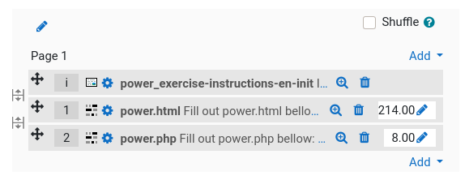

# PySourceCloze: Quick Start Guide

This page details seven steps to generate your first source cloze quiz:
* [STEP 1: Editing Your Lexicon (.json)](#editing)
* [STEP 2: Enclosing Your Source File (.* + .json &#8614; .clo)](#enclosing)
* [STEP 3: Checking Enclosed Files (.clo)](#checking)
* [STEP 4: Getting Cloze (.clo &#8614; .clz.xml or .clz.html)](#getting)
* [STEP 5: Creating Cloze on Moodle](#creating)
* [STEP 6: Embedding Script in Moodle](#embedding)
* [STEP 7: Making and Testing Your Quiz](#making)

## STEP 1: Editing Your Lexicon (.json)<a id="editing"/>

Describe your lexicon in a JSON file.

Three sample examples for C and PHP programs, HTML pages, and SQL queries:

#### `samples/C/lexicon.json`
```json
[
    {
        "points": "1",
        "patterns": [ ";" ]
    },
    {
        "points": "2",
        "patterns": [ "{", "}" ]
    },
    {
        "points": "3",
        "patterns": [ "include", "int", "main", "return", "printf" ]
    }
]
```

#### `samples/PHP-HTML/lexicon.json`
```json
[
    {
        "points": "1",
        "patterns": [ ";" ]
    },
    {
        "points": "2",
        "patterns": [ "{", "}" ]
    },
    {
        "points": "3",
        "patterns": [ "html", "/html", "head", "/head", "title", "/title", "body", "/body", "h1", "/h1", "href" ]
    },
    {
        "points": "5",
        "patterns": [ "form", "input", "type", "name", "submit", "action", "post" ]
    },
    {
        "points": "5",
        "patterns": [ "echo" ]
    },
    {
        "points": "5",
        "patterns": [ "return", "function", "if", "for" ]
    }
]
```

#### `samples/SQL/lexicon.json`
```json
[
    {
        "points": "1",
        "patterns": [ ";" ]
    },
    {
        "points": "3",
        "patterns": [ "SELECT", "FROM", "WHERE" ]
    },
    {
        "points": "4",
        "patterns": [ "JOIN", "ON", "GROUP", "BY", "GROUP BY", "ORDER", "ORDER BY", "ASC", "DESC", "HAVING", "" ]
    }
]
```

## STEP 2: Enclosing Your Source File (.* + .json &#8614; .clo)<a id="enclosing"/>

You have to enclose the patterns you wish to evaluate in your source file, using the default delimiter `§`.

Three complementary ways can do enclosing:

1. [Manually](#enclosing-manually): By editing your source file to enclose manually evaluated elements with delimiters and assigning points to patterns (i.e., `§pts§pattern§`).

2. [Semi-automatically](#enclosing-fill): By editing your source file to enclose manually evaluated elements with delimiters and assigning points to patterns (i.e., `§pts§pattern§`) or not (i.e., `§§pattern§`); then running PySourceCloze to automatically **fill** empty points with values from the lexicon and a given value for elements out of the lexicon (i.e., `outer_points`).

3. [Automatically](#enclosing-enclose): By running PySourceCloze to **enclose** lexemes from the lexicon; then checking for unanticipated or unwanted replacements; then refining by adding or removing some enclosings.

Example of enclosed file:

#### `main.c.clo`
```
§3§include§ <stdio.h>
#§3§include§ <stdlib.h>

§3§int§ §3§main§ () §2§{§
  §3§printf§("Hello World!!!\n") §1§;§

  §3§return§ EXIT_SUCCESS §1§;§
§2§}§
```

_Note 1: exclude chevrons from lexemes enclosing._

_Note 2: the default enclosing delimiter character is `§`, but the option `-d DELIMITER`, `--delimiter DELIMITER` can set another delimiter. `£` may be a working alternative for most languages_

The three following subsections provide some examples.

### Manual Enclosing<a id="enclosing-manually"/>

Edit your source file to manually enclose evaluated elements: `§pts§pattern§` (`pts` are the points assigned to the `pattern`). Manual enclosing is especially useful when evaluating few language elements but many values or fields, for example:

#### `query.sql.clo`
```
§5§SELECT§ `§5§supplier§`.`§5§name§`, COUNT(`§5§machine§`.`§5§id§`), COUNT(DISTINCT `§5§maintenance§`.`§5§id§`))
§5§FROM§ `§5§supplier§`
JOIN `machine` ON `§5§supplier§`.`id` = `§5§machine§`.`§5§id_supplier§`
JOIN `maintenance` ON `§5§machine§`.`id` = `§5§maintenance§`.`§5§id_machine§`
GROUP BY `§5§supplier§`.`§5§id§` ;
```

### Assisted Enclosing<a id="enclosing-fill"/>

Assisted enclosing gives values automatically to empty points in your source file (i.e., `§§pattern§`). To do so, running PySourceCloze will **fill** empty points with values from the lexicon and with the `outers_points` value for elements out of the lexicon.

Example:

Edit your source file:

#### `hello.c.clo`
```
#§§include§ <§§stdio.h§>

§§int§ main () {

  §§printf§ ("Hello world!§§\n§") ;

  §§return§ 0 ;
}
```

Run PySourceCloze in **fill** mode:

```console
user@host:~$ cd ~/pysourcecloze
user@host:~/pysourcecloze$ python3 pysoclz.py fill samples/C/lexicon.json samples/C/hello.c.clo 5 --print
#§3§include§ <§5§stdio.h§>

§3§int§ main () {

  §3§printf§ ("Hello world!§5§\n§") ;

  §3§return§ 0 ;
}
```

### Automatic Enclosing<a id="enclosing-enclose"/>

Automatic enclosing encloses lexemes from the lexicon in your source file. To do so, running PySourceCloze will **enclose** lexemes from the lexicon. Of course, you will then have to **always check** for unanticipated or unwanted enclosings. Finally, you can customize by adding or removing some enclosed patterns manually.

Example:

Let's take an HTML form and its associated PHP script:

#### `power.html`
```
<!DOCTYPE html>
<html>
  <head>
    <meta charset="utf-8" />
    <title>Power</title>
  </head>
  <body>
    <h1>Power</h1>
    <form action="power.php" method="post">
      <p>Voltage: <input type="number" name="voltage" step="0.1" /> V</p>
      <p>Current: <input type="number" name="current" step="0.1" />
        <input id="A" type="radio" name="unit" value="A" checked="checked" />
        <label for="A" />A</label>
        <input id="mA" type="radio" name="unit" value="mA" />
        <label for="mA" />mA</label>
      </p>
      <p><input type="submit" value="Power" /></p>
    </form>
  </body>
</html>
```

#### `power.php`
```
<!DOCTYPE html>
<html>
    <head>
        <meta charset="utf-8" />
        <title>Power</title>
    </head>
    <body>
        <h1>Power</h1>
        <?php
        
        function show($text, $val, $unit) {
            echo '<p>'.$text.' = '.$val.' '.$unit.'</p>' ;
        }
        
        $factor = ($_POST['unit'] == 'mA') ? .001 : 1 ;
        
        $V = $_POST['voltage'] ;
        $I = $_POST['current'] * $factor ;
        $P = $V * $I ;
        
        show('Voltage', $V, 'V') ;
        show('Current', $I, 'A') ;
        show('Power', $P, 'W') ;
        
        ?>
        <p><a href="power.html">Do it again</a></p>
    </body>
</html>
```

Run PySourceCloze in **enclose** mode:

```console
user@host:~/pysourcecloze$ python3 pysoclz.py enclose samples/PHP-HTML/lexicon.json samples/PHP-HTML/power.html --print
<!DOCTYPE §3§html§>
<§3§html§>
  <§3§head§>
    <meta charset="utf-8" />
    <§3§title§>Power<§3§/title§>
  <§3§/head§>
  <§3§body§>
    <§3§h1§>Power<§3§/h1§>
    <§5§form§ §5§action§="power.php" method="§5§post§">
      <p>Voltage: <§5§input§ §5§type§="number" §5§name§="voltage" step="0.1" /> V</p>
      <p>Current: <§5§input§ §5§type§="number" §5§name§="current" step="0.1" />
        <§5§input§ id="A" §5§type§="radio" §5§name§="unit" value="A" checked="checked" />
        <label §5§for§="A" />A</label>
        <§5§input§ id="mA" §5§type§="radio" §5§name§="unit" value="mA" />
        <label §5§for§="mA" />mA</label>
      </p>
      <p><§5§input§ §5§type§="§5§submit§" value="Power" /></p>
    </§5§form§>
  <§3§/body§>
<§3§/html§>
```

```console
user@host:~/pysourcecloze$ python3 pysoclz.py enclose samples/PHP-HTML/lexicon.json samples/PHP-HTML/power.php --print
<!DOCTYPE §3§html§>
<§3§html§>
    <§3§head§>
        <meta charset="utf-8" />
        <§3§title§>Power<§3§/title§>
    <§3§/head§>
    <§3§body§>
        <§3§h1§>Power<§3§/h1§>
        <?php

        §5§function§ show($text, $val, $unit) §2§{§
            §5§echo§ '<p>'.$text.' = '.$val.' '.$unit.'</p>' §1§;§
        §2§}§

        $factor = (§5§$_POST§['unit'] == 'mA') ? .001 : 1 §1§;§

        $V = §5§$_POST§['voltage'] §1§;§
        $I = §5§$_POST§['current'] * $factor §1§;§
        $P = $V * $I §1§;§

        show('Voltage', $V, 'V') §1§;§
        show('Current', $I, 'A') §1§;§
        show('Power', $P, 'W') §1§;§

        ?>
        <p><a §3§href§="power.§3§html§">Do it again</a></p>
    <§3§/body§>
<§3§/html§>
```

Add or remove manually some enclosed patterns (e.g., html after DOCTYPE, show function calls)

#### `power.html.clo`
```
<!DOCTYPE html>
<§3§html§>
  <§3§head§>
    <meta charset="utf-8" />
    <§3§title§>Power<§3§/title§>
  <§3§/head§>
  <§3§body§>
    <§3§h1§>Power<§3§/h1§>
    <§5§form§ §5§action§="power.php" method="§5§post§">
      <p>Voltage: <§5§input§ §5§type§="§6§number§" §5§name§="§8§voltage§" §5§step§="0.1" /> V</p>
      <p>Current: <§5§input§ §5§type§="§6§number§" §5§name§="§8§current§" §5§step§="0.1" />
        <§5§input§ §5§id§="A" §5§type§="§6§radio§" §5§name§="§8§unit§" value="A" checked="§3§checked§" />
        <label §5§for§="A" />A</label>
        <§5§input§ §5§id§="mA" §5§type§="§6§radio§" §5§name§="§8§unit§" value="mA" />
        <label §5§for§="mA" />mA</label>
      </p>
      <p><§5§input§ §5§type§="§5§submit§" value="Power" /></p>
    </§5§form§>
  <§3§/body§>
<§3§/html§>
```

#### `power.php.clo`
```
<!DOCTYPE html>
<§3§html§>
    <§3§head§>
        <meta charset="utf-8" />
        <§3§title§>Power<§3§/title§>
    <§3§/head§>
    <§3§body§>
        <§3§h1§>Power<§3§/h1§>
        <?php

        function show($text, $val, $unit) §2§{§
            §5§echo§ '<p>'.$text.' = '.$val.' '.$unit.'</p>' §1§;§
        §2§}§

        $factor = (§8§$_POST§['unit'] == 'mA') ? .001 : 1 §1§;§

        $V = §8§$_POST§['voltage'] §1§;§
        $I = §8§$_POST§['current'] * §6§$factor§ §1§;§
        $P = $V §6§*§ §6§$I§ §1§;§

        §7§show§('§6§Voltage§', §6§$V§, '§6§V§') §1§;§
        §7§show§('§6§Current§', §6§$I§, '§6§A§') §1§;§
        §7§show§('§6§Power§', §6§$P§, '§6§W§') §1§;§

        ?>
        <p><§3§a§ §3§href§="power.html">Do it again</§3§a§></p>
    <§3§/body§>
<§3§/html§>
```

## STEP 3: Checking Enclosed Files (.clo)<a id="checking"/>

PySourceCloze helps you check:
1. [The correctness of the edited source file](#checking-correctness);
2. [The consistency of your evaluation](#checking-consistency).

The two following subsections show checking examples.

### Checking Correctness<a id="#checking-correctness"/>

PySourceCloze can **clean** enclosed patterns to show back the raw source code (cleaned of delimiters).

Example:

```console
user@host:~$ cd ~/pysourcecloze
user@host:~/pysourcecloze$ python3 pysoclz.py clean samples/C/main.c.clo
#include <stdio.h>
#include <stdlib.h>

int main () {
  printf("Hello World!!!\n") ;

  return EXIT_SUCCESS ;
}
```

### Checking Consistency<a id="#checking-consistency"/>

Check the consistency of your evaluation from an overview of points distribution among patterns. To do so, PySourceCloze can **sum** the number of points attributed to evaluated patterns.

Example:

```console
user@host:~$ cd ~/pysourcecloze
user@host:~/pysourcecloze$ python3 pysoclz.py sum samples/C/main.c.clo
   Points    Percent    Pattern
        6        25%    include
        3        12%    int
        3        12%    main
        3        12%    printf
        3        12%    return
        2         8%    {
        2         8%    ;
        2         8%    }
       24 pts           8 patterns
```

## STEP 4: Getting Cloze (.clo &#8614; .clz.xml or .clz.html)<a id="getting"/>

PySourceCloze reads a decorated file to **generate** the HTML or XML cloze question for Moodle. The option `-qt QUESTION_FILE`, `--question-text QUESTION_FILE` inserts some HTML code optionally before the cloze.

Examples:

Generate the HTML code of a cloze:

```console
user@host:~/pysourcecloze$ python3 pysoclz.py generate samples/C/helloworld.c.clo HTML --print 
<pre id="helloworld_c_clo" class="cloze">
#{3:SAC:=include} &lt;{4:SAC:=stdio.h}&gt;

{3:SAC:=int} {3:SAC:=main} () {2:SAC:={}

  {3:SAC:=printf} ("Hello world!{4:SAC:=\n}") {1:SAC:=;}

  {3:SAC:=return} 0 {1:SAC:=;}
{2:SAC:=}}
</pre>
<script>load('helloworld_c_clo', [7, 7, 3, 4, 1, 6, 2, 1, 6, 1, 1])</script>
```

Generate the XML question file of a numbered cloze:

```console
user@host:~/pysourcecloze$ python3 pysoclz.py generate samples/C/helloworld.c.clo XML-NUMS -qt samples/question.inc.html
Output filename: 'samples/C/helloworld.c.clz.xml'
```


## STEP 5: Creating Cloze on Moodle<a id="creating"/>

Creating the cloze on Moodle can be done two ways:
* By [importing a cloze from XML question files](#creating-xml);
* By [copying cloze HTML code in questions text](#creating-html).

### Creating From XML File Import<a id="creating-xml"/>

1. Go at the "Import" function of the "Question bank";
2. Select "Moodle XML format" as file format;
3. Choose the XML question file from your disk, and click the import button. 

### Creating From HTML Code Copy<a id="creating-html"/>

Create a cloze question on Moodle, and edit question text:

1. Create a new cloze in "Question bank";
2. Click to show "advanced buttons" of the editor;
3. Click to switch editor in raw "HTML" mode;
4. Copy the cloze code. (_Carefully include the script line that creates the source cloze on time!)_

## STEP 6: Embedding Script in Moodle<a id="embedding"/>

An init script is required in Moodle quizzes to **init** source clozes. You will have to embed it **before** all source clozes (see [Step 7](#making)). PySourceCloze embeds both the init script and general filling instructions as a Moodle "description" question when using the init command: the instructions' language is then specified; the option `-qt QUESTION_FILE`, `--question-text QUESTION_FILE` inserts some HTML optionally after general instructions.

Two ways can get the description that embeds the script and the general instructions:
* By [importing an XML question file](#embedding-xml);
* By [copying the HTML code in the description text](#embedding-html).

### Embedding From XML File Import<a id="embedding-xml"/>

1. Get the init instructions in XML format. For example:
```console
user@host:~/pysourcecloze$ python3 pysoclz.py init EN XML -qt samples/PHP-HTML/power_exercise.inc.html 
Output filename: 'samples/PHP-HTML/power_exercise-instructions-en.ini.xml'
```
2. Go at the "Import" function of the "Question bank";
3. Select "Moodle XML format" as file format;
4. Choose the XML question file from your disk, and click the import button. 

Caution: You will later have to insert this new description as **the first** item of your quiz (see [Step 7](#making)).

### Embedding From HTML Code Copy<a id="embedding-html"/>

Create a Moodle "description" question that will include students' instructions and embed scripts for your cloze questions.

1. Get the init instructions in HTML format. For example:
```console
user@host:~/pysourcecloze$ python3 pysoclz.py init EN HTML
Output filename: 'sourcecloze-instructions-en.ini.html'
```
2. Create a new description in "Question bank";
3. Click to show "advanced buttons" of the editor;
4. Click to switch editor in raw "HTML" mode;
5. Copy and paste instructions and script.

Caution: You will later have to insert this new description as **the first** item of your quiz (see [Step 7](#making)).

## STEP 7: Making and Testing Your Quiz<a id="making"/>
   
1. Add the description question and the source cloze questions to your quiz:

    
    
2. Place the description question&mdash;that embeds the init script&mdash;as **the first** item of the page (or **of each page** if there are several ones):

    
    
3. Adjust maximum marks:

    
    
4. Do **not** shuffle questions.

5. Test the quiz:

   
   
You are done!

---
[](https://creativecommons.org/licenses/by-sa/4.0/) Guillaume Rivière, 2022, [ESTIA](https://www.estia.fr), France.
